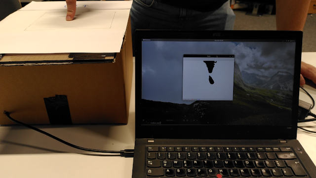
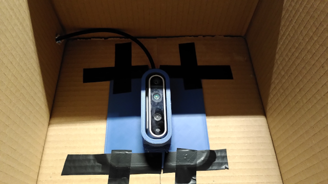
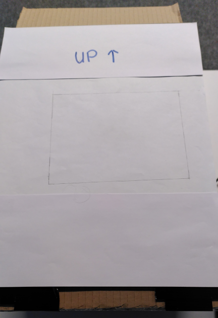
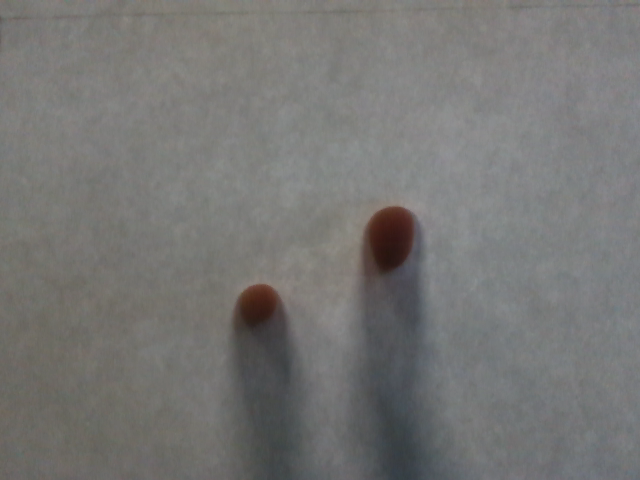
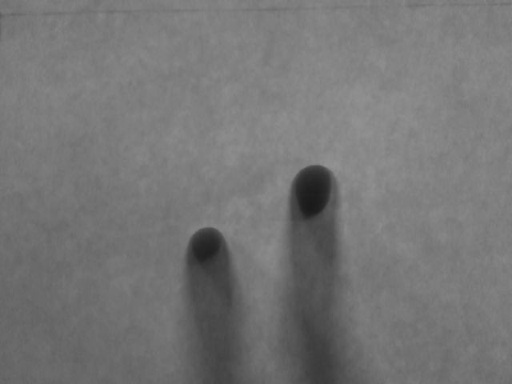
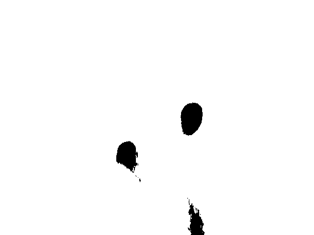
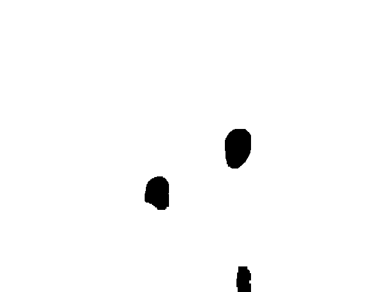
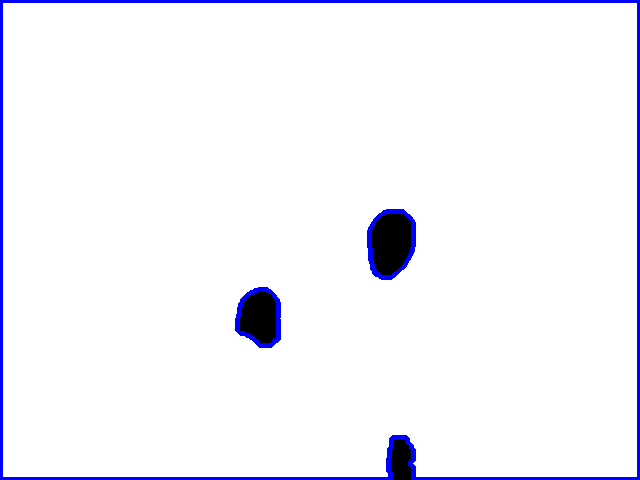
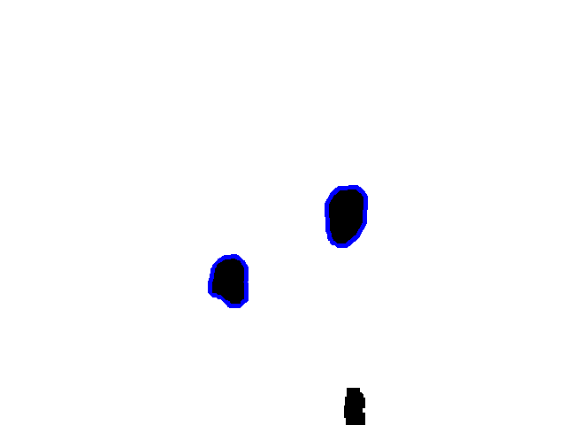

# DIY Camera Setup to Create a Touch Sensor

The following document describes a touchscreen implementation, that relies on a webcam feed and is able to distinguish between touch and hover inputs.



# Hardware

The DIY camera setup consists of a cardboard box and an [Intel Realsense D435](https://store.intelrealsense.com/buy-intel-realsense-depth-camera-d435.html) placed inside of it, facing upwards.

| Asset         | Width (cm) | Length (cm) | Height (cm) |
| ------------- | ---------- | ----------- | ----------- |
| Cardboard Box | 28         | 28          | 19.5        |
| Acrylic Sheet | 27.5       | 41          | 0.5         |
| Webcam        | 2.5        | 9           | 2.5         |

The webcam is mounted on a customized version of the [REALSENSE D435 Mount](https://www.thingiverse.com/thing:4639450). (Shoutout to Team Extreme!)



This setup results in a lens-to-sheet distance of 16.5 cm. The webcam detects a touch area of about 13 cm by 17.5 cm.

In order to diffuse the light and reduce unwanted light pollution, we covered the acrylic sheet with paper and marked the detected touch area.



# Software

The purpose of this software is to detect fingers on the touch area and distinguish between a touch and hover input.

## Filtering

In order to achieve finger detection, we extract a frame from the camera feed and apply the following transformations to it.

Image with no transformations applied:



As a first step, we convert it to the gray color space.



We apply a binary threshold to filter out certain values.



We dilated and eroded the frame with a (10|10) kernel to reduce noise and achieve a better distinction of shapes.



This transformed frame was now used to detect contours.



We filter the contours based on their size to avoid false positives.



To translate the contours into coordinates, we draw bounding boxes around them, retrieve the x and y values of the center, and send a DIPPID event with these coordinates.

## Hover and Touch Distinction

To realize a distinction between touch and hover interactions, we apply two different binary filters to the original image:

- An aggressive binary filter with a comparatively low threshold that only recognizes touch inputs
  A less aggressive binary filter, which recognizes more distant fingers

The remainder of the image processing steps as described in [Filtering](#Filtering) stay the same for both touch interactions.

## Adaptive Threshold

Our system adapts to different lighting conditions by calibrating the thresholds used for binary filtering.

During the calibration step, the user is prompted to place a finger on the touch area for 5 seconds. Our system computes a threshold for every frame in this period by applying [Otsu's Binarization](https://docs.opencv.org/3.4/d7/d4d/tutorial_py_thresholding.html).

These threshold values are averaged and divided by either:

- **2.8** for touch input threshold
- **1.8** for hover input threshold

In our testing sessions, we found these values to deliver the most consistent distinction between hovering and touching.

## Usage

To start the program run

```
python touch-input.py
```

and follow the calibration process (e.g., place your finger on the touch area until the calibration is performed).

Finger positions on the touch area are sent via the DIPPID protocol to port 5700 on localhost.

To achieve the best possible performance, try to:

- Avoid direct light above the box
- Perform inputs while standing
- Keep your fingers at a high angle while interacting

These precautions should be taken in order to avoid casting a lot of shadows, which might impair frame processing.
